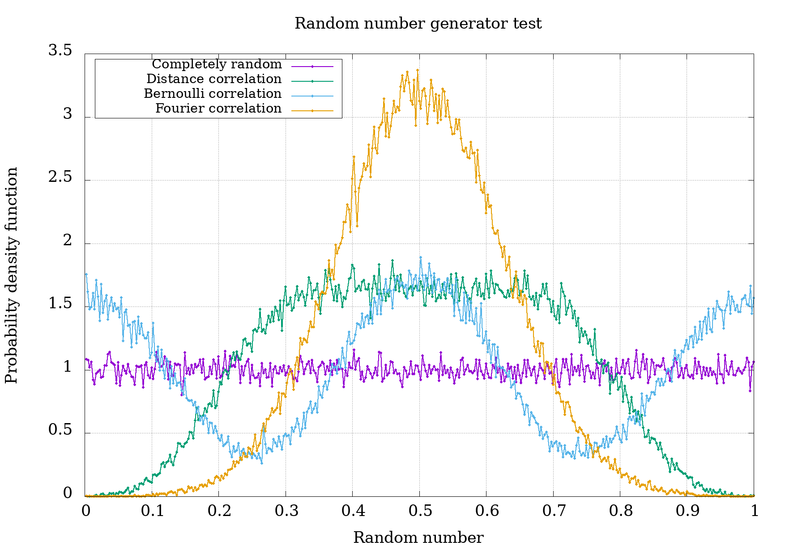

[](https://www.paypal.com/cgi-bin/webscr?cmd=_s-xclick&hosted_button_id=D66EM3DGU35EE&source=url)
[](/LICENSE)


# LibIsmael
C library that I wrote for minimize my work.

## How to use

That are two distinct ways to use the library in your project:
1) Include files (most easy); and 2) Install in your system.

### Include files

This way is very easy, you must to copy the directory `libismael`
to the directory of your project and include the file `libismael/ismael.h`
above and the file `libismael/ismael.c` after the `main` function, like this:
```c
#include "libismael/ismael.h"

int main(int argc, char **argv){
   /* Your code */
}

#include "libismael/ismael.c"
```

### Install in your system

Another way, if you use linux, is copying the file `ismael.h`
to `/usr/include`, compile `ismael.c` as static library
(you can use the script [COMPILE](COMPILE) as, in terminal, `bash COMPILE`)
and copy the file `libismael.a` to `/usr/lib`.
Then you include the library
in your code and compile and link the executable
(like `gcc main.c -lm -lismael`), you code may be look like this:
```c
#include <ismael.h>

int main(int argc, char **argv){
   /* Your code */
}
```

## Basic features

## Random numbers

The LibIsmael library provide some functions to generate random numbers,
for pseudo-random number generator the basic use is
`double_variable = ismael.random.GENERATOR(&seed)`
where `GENERATOR` is either `system`, `mt32` or `mt64`.
For correlated random numbers the basic use is
`double_pointer = ismael.random.GENERATOR(correlation_parameter, number_of_random_numbers, seed)`
where `GENERATOR` is either `distance`, `bernoulli` or `fourier`.

* `double ismael.random.system(int *y)`:
Generate a pseuso-random number using the default generator of C,
i.e. `rand` of `stdlib.h`.
The function return a double precision pseudo-random value in [0, 1).
The value `y` in retur point to a integer pseudo-random number in [0, RAND_MAX].
In first call `y` point to any integer to initialize the generator.
* `double ismael.random.mt32(uint32_t *y)`:
Generate a pseuso-random number using the _mersenne twister_ method
with a word of 32 bit.
The function return a double precision pseudo-random value in [0, 1).
The value `y` in retur point to a positive integer
pseudo-random number in [0, UINT32_MAX].
To initialize/reinitialize the generator change
`y` to point any positive integer.
* `double ismael.random.mt64(uint64_t *y)`:
Generate a pseuso-random number using the _mersenne twister_ method
with a word of 64 bit.
The function return a double precision pseudo-random value in [0, 1).
The value `y` in retur point to a positive integer
pseudo-random number in [0, UINT64_MAX].
To initialize/reinitialize the generator change
`y` to point any positive integer.
* `double* ismael.random.distance(double alpha, int N, int seed)`:
Generate a serie of correlated random numbers using
the serie (1).
The function return a array with the correlated random double precision numbers
in [0, 1).
`alpha > 0` is a parameter to control correlations.
`N` is the quantity of correlated numbers.
`seed` is a seed to initialize the generator.
* `double* ismael.random.bernoulli(double alpha, int N, int seed)`:
Generate a serie of correlated random numbers using
the iteration (2).
The function return a array with the correlated random double precision numbers
in [0, 1).
`alpha >= 0` is a parameter to control correlations.
`N` is the quantity of correlated numbers.
`seed` is a seed to initialize the generator.
* `double* ismael.random.fourier(double alpha, int N, int seed)`:
Generate a serie of correlated random numbers using
the serie (3).
The function return a array with the correlated random double precision numbers
in [0, 1).
`alpha >= 0` is a parameter to control correlations.
`N` is the quantity of correlated numbers.
`seed` is a seed to initialize the generator.



## Statistics

* `double** FDP(double *valor, int N, int particoes)`:
Generate a matrix with the points of a Probability Density Function (PDF) of the array `valor`.
Let be `y = f(x)` the PDF,
the function return a matrix with the values `matrix[0][i]` is the x value of the PDF
and `matrix[1][i]` is the y value of the PDF.
`N` is the size of the array `valor`, this array contains the sample values to compute the PDF.
`particoes` is a "bin" discretization for the computation of the PDF.

## Donate

You can donate to the creator I. F. F. dos Santos (@ismaeldamiao)
through PayPal by clicking  in the link
[https://www.paypal.com/cgi-bin/webscr?cmd=_s-xclick&hosted_button_id=D66EM3DGU35EE&source=url](https://www.paypal.com/cgi-bin/webscr?cmd=_s-xclick&hosted_button_id=D66EM3DGU35EE&source=url).

Se você possiu conta em algum banco que opera junto ao Banco Central do Brasil
você também pode doar usando o PIX `ismaellxd@gmail.com`.
